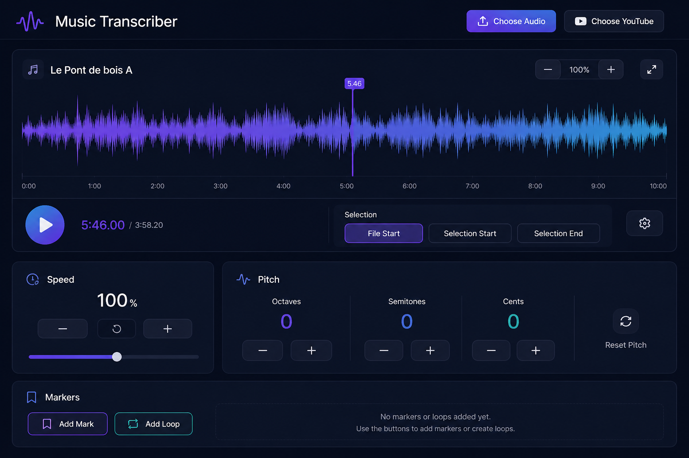

# Muse Transcribe

**A free, open-source browser app for musicians to slow down, loop, and transcribe audio.**

Load a local audio file or paste a YouTube link, slow it down without changing pitch, loop a tricky section, and drop markers as you work through a piece.

🌐 **Live at [muse-transcribe.com](http://muse-transcribe.com)**



---

## Features

- **Local audio files** — open MP3, WAV, FLAC, OGG, and any format the browser supports
- **YouTube playback** — paste a YouTube URL to play directly in the app
- **Variable speed** — slow down or speed up playback from 25 % to 200 % without affecting pitch
- **Pitch shifting** — shift pitch up or down by up to 24 semitones (±2400 cents) independently of tempo
- **Zoomable waveform** — interactive timeline with 1× – 20× zoom and click-to-seek
- **Loop selection** — drag a region on the timeline; playback bounces inside the selection
- **Markers & saved loops** — drop markers at any point (`M`) or save the current selection as a named loop
- **Per-source settings** — tempo, pitch, zoom, markers, and loops are automatically saved per file / video
- **Keyboard shortcuts** — control everything without touching the mouse (see below)

---

## Getting Started

### Prerequisites

- [Node.js](https://nodejs.org/) 18+
- npm (bundled with Node)

### Install & run

```bash
git clone https://github.com/eliaweiss/trasncribe.git
cd trasncribe
npm install
npm run dev
```

Open [http://127.0.0.1:8001](http://127.0.0.1:8001) in your browser.

### Production build

```bash
npm run build   # output goes to dist/
```

---

## Keyboard Shortcuts

| Key | Action |
|-----|--------|
| `Space` | Play / Pause |
| `R` | Restart from beginning |
| `M` | Drop a marker at the current position |
| `F` | Jump to the start of the file |
| `S` | Jump to the selection start |
| `E` | Jump to the selection end |

---

## Extract Audio from a Video File

The repo includes a small helper script that uses [ffmpeg](https://ffmpeg.org/) to strip audio from a video:

```bash
# Install ffmpeg first (macOS)
brew install ffmpeg

# Extract audio — defaults to MP3
npm run extract:audio path/to/video.mp4

# Specify the output format
node scripts/extract-audio.mjs path/to/video.mp4 path/to/audio.wav
```

---

## Tech Stack

| Layer | Technology |
|-------|-----------|
| UI framework | [React 19](https://react.dev/) |
| Build tool | [Vite](https://vitejs.dev/) |
| Pitch / tempo processing | [SoundTouchJS](https://github.com/cutterbl/SoundTouchJS) |
| Audio decoding | Web Audio API |
| Video playback | YouTube IFrame Player API |

---

## Project Structure

```
src/
├── main.jsx                  # App entry point
├── App.jsx                   # Top-level state: playback, marks, selection
├── hooks/
│   └── useAudioPlayer.js     # Web Audio + SoundTouchJS + YouTube playback
├── components/
│   ├── Landing.jsx           # Drop zone / YouTube input
│   ├── Player.jsx            # Waveform + timeline container
│   ├── WaveformCanvas.jsx    # Canvas waveform renderer
│   ├── Timeline.jsx          # Time ruler and tick marks
│   ├── Transport.jsx         # Play/pause/seek controls
│   ├── SpeedControl.jsx      # Tempo slider
│   ├── PitchControl.jsx      # Pitch slider
│   ├── ControlPanel.jsx      # Markers & loops panel
│   └── ...
└── utils/
    ├── audioBuffer.js        # Audio decoding & time formatting
    └── youtube.js            # YouTube URL parsing
scripts/
└── extract-audio.mjs         # ffmpeg helper for stripping audio from video
```

---

## Contributing

Contributions are welcome! Please open an issue to discuss what you'd like to change, then submit a pull request.

1. Fork the repo
2. Create your branch: `git checkout -b feature/my-feature`
3. Commit your changes: `git commit -m "add my feature"`
4. Push to the branch: `git push origin feature/my-feature`
5. Open a Pull Request

---

## License

MIT — see [LICENSE](LICENSE) for details.
